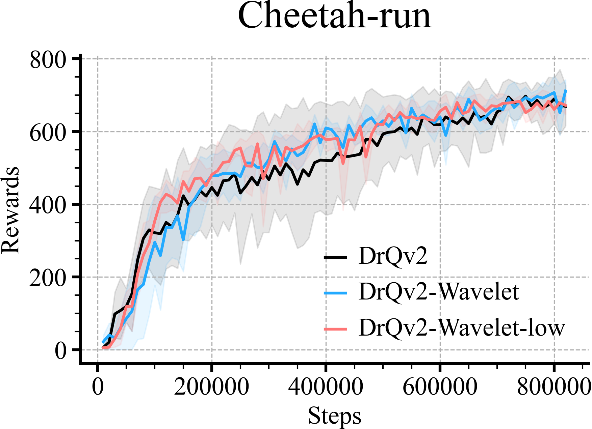
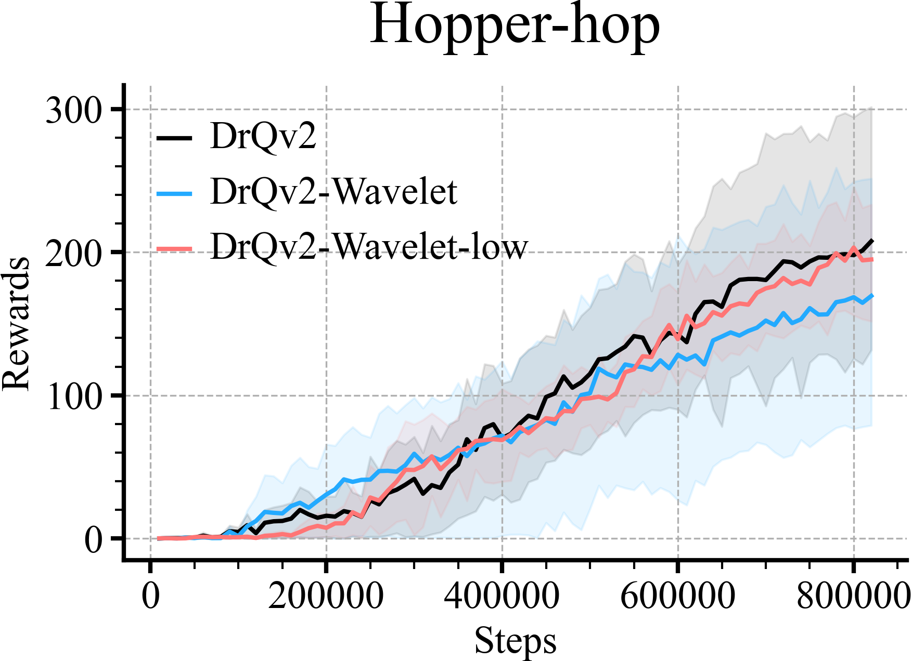
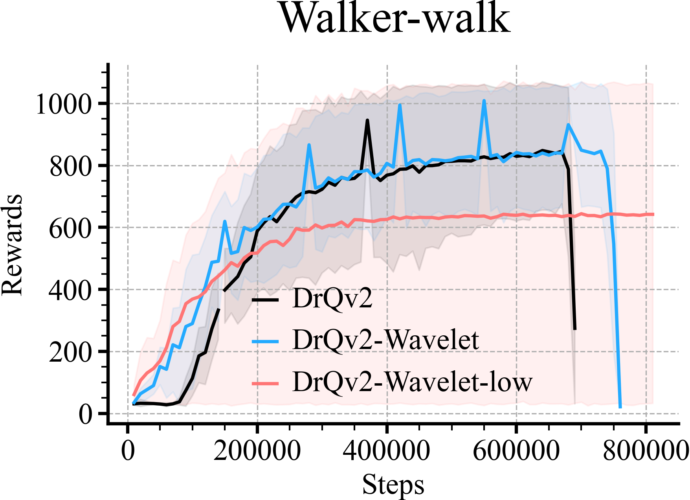
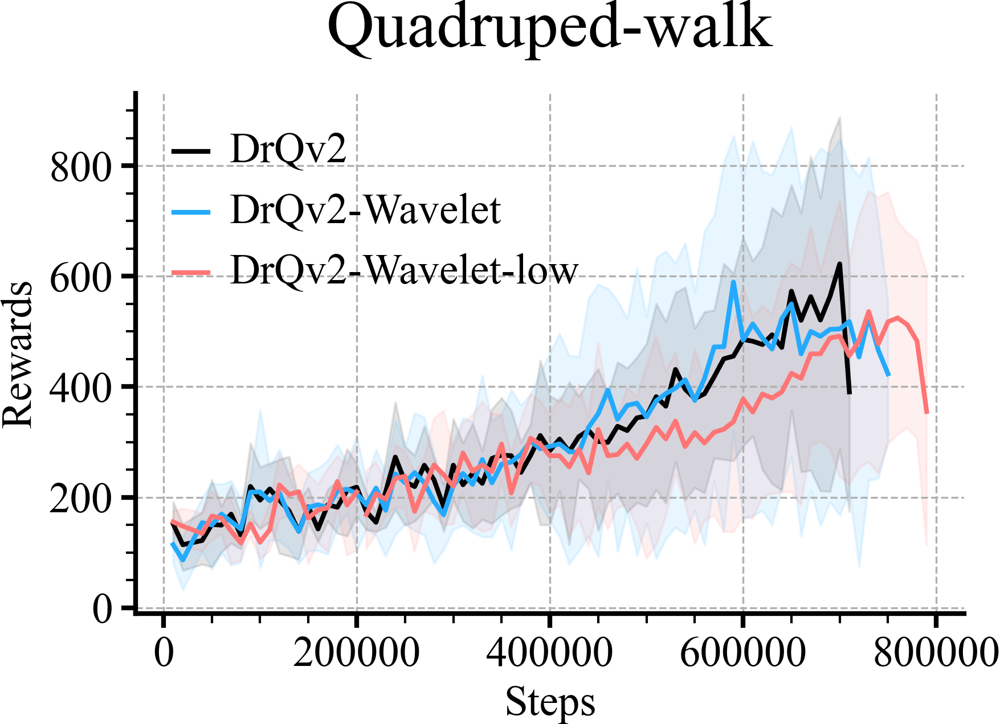
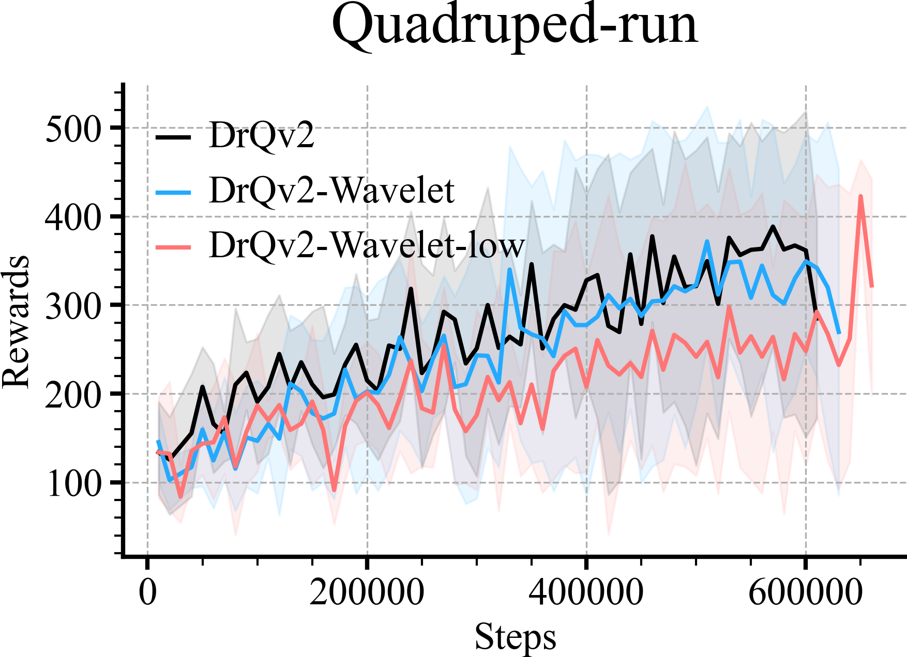

# MUJOCO Comparisons
```python
loader = ML_Logger(prefix="model-free/model-free")
```
```python
def plot_line(path, color, label, x_key):
    print(path)
    mean, low, high, step, = loader.read_metrics("eval/episode_reward@mean",
                                                 "eval/episode_reward@16%",
                                                 "eval/episode_reward@84%",
                                                 x_key=f"{x_key}@min", path=path)
    plt.xlabel('Steps', fontsize=18)
    plt.ylabel('Rewards', fontsize=18)

    if color is None:
        plt.plot(step.to_list(), mean.to_list(), label=label)
        plt.fill_between(step, low, high, alpha=0.1)
    else:
        plt.plot(step.to_list(), mean.to_list(), color=color, label=label)
        plt.fill_between(step, low, high, alpha=0.1, color=color)
```
```python
r = doc.table().figure_row()
for env in tqdm(envs, desc="env"):
    plot_line(path=f"drqv2_crff_analysis/wavelet/dmc/mlp/mlp/{env}/**/metrics.pkl", color='black',
              label=f'DrQv2', x_key='eval/frame')
    plot_line(path=f"drqv2_crff_analysis/wavelet/dmc/mlp/wavelet/{env}/**/metrics.pkl", color=colors[0],
              label=f'DrQv2-Wavelet', x_key='eval/frame')
    plot_line(path=f"drqv2_crff_analysis/wavelet/dmc/mlp/wavelet_only_low/{env}/**/metrics.pkl", color=colors[1],
              label=f'DrQv2-Wavelet-low', x_key='eval/frame')

    plt.title(env)
    plt.legend()
    plt.tight_layout()
    r.savefig(f'{os.path.basename(__file__)[:-3]}/{env}.png', dpi=300, zoom=0.3, title=env)
    # plt.savefig(f'{os.path.basename(__file__)[:-3]}/{env}.pdf', dpi=300, zoom=0.3)
    plt.close()
```

| **Cheetah-run** | **Hopper-hop** | **Walker-walk** | **Quadruped-walk** | **Quadruped-run** |
|:---------------:|:--------------:|:---------------:|:------------------:|:-----------------:|
|  |  |  |  |  |
