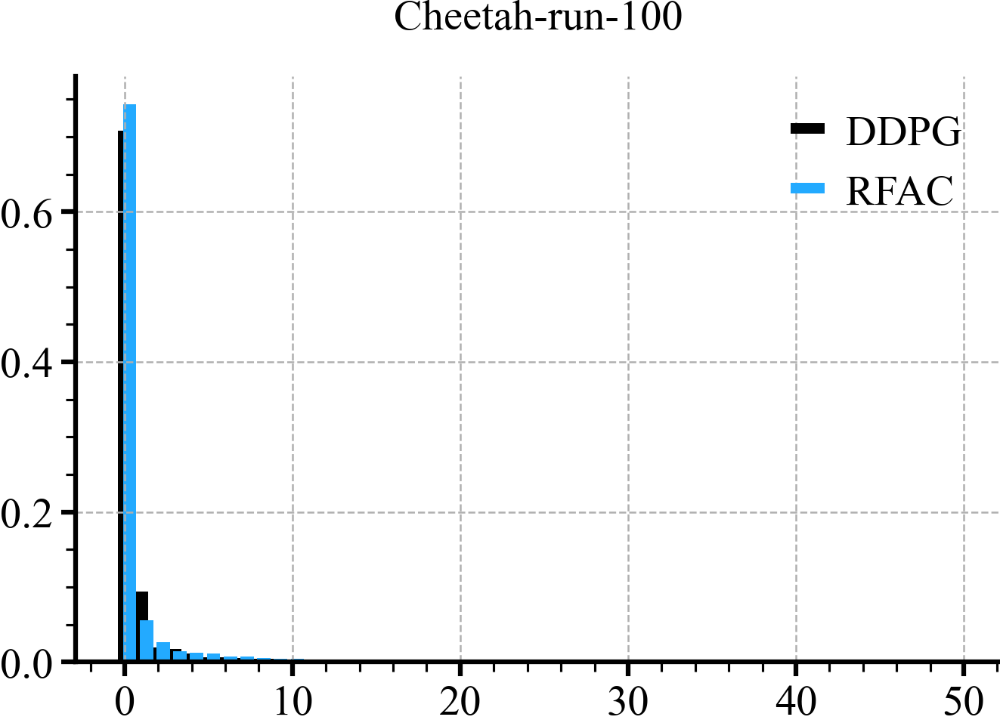

```python
for b_val, env_name in tqdm(zip(b_vals, envs), desc="b_val, env"):
    r = doc.table().figure_row()
    print(env_name)

    for seed in all_seeds:
        ddpg_agent_path = f"{prefix}/mlp/{env_name.split(':')[-1][:-3]}/{seed}/checkpoint/agent.pkl"
        ddpg_rb_path = f"{prefix}/mlp/{env_name.split(':')[-1][:-3]}/{seed}/checkpoint/replay_buffer.pkl"
        rfac_agent_path = f"{prefix}/rff_mean_std_full/rff/iso/b-{b_val}/{env_name.split(':')[-1][:-3]}/{seed}/checkpoint/agent.pkl"
        rfac_rb_path = f"{prefix}/rff_mean_std_full/rff/iso/b-{b_val}/{env_name.split(':')[-1][:-3]}/{seed}/checkpoint/replay_buffer.pkl"

        print(f"DDPG, env-{env_name}, seed-{seed}")
        ddpg_svals = calc_rank_from_rb(ddpg_agent_path, ddpg_rb_path)
        ddpg_svals = ddpg_svals[:50]

        print(f"RFAC, env-{env_name}, b-{b_val}, seed-{seed}")
        rfac_svals = calc_rank_from_rb(rfac_agent_path, rfac_rb_path)
        rfac_svals = rfac_svals[:50]

        width = 0.3
        x_range = list(range(50))

        plt.title(f"{env_name.split(':')[-1][:-3]}-{seed}", fontsize=18)
        plt.bar(x_range, ddpg_svals, color='black', label='DDPG')
        plt.bar([x + width for x in x_range], rfac_svals, color=colors[0], label='RFAC')
        plt.legend()
        plt.tight_layout()
        r.savefig(f"s_val_plot/seed_{seed}/{env_name.split(':')[-1][:-3]}_norm.png")
        plt.close()
```

|  |  |  |  |  |
|:---------------------------------------------------------------------------------------------------------------------------------------------------------:|:---------------------------------------------------------------------------------------------------------------------------------------------------------:|:---------------------------------------------------------------------------------------------------------------------------------------------------------:|:---------------------------------------------------------------------------------------------------------------------------------------------------------:|:---------------------------------------------------------------------------------------------------------------------------------------------------------:|

|  |  |  |  |  |
|:-------------------------------------------------------------------------------------------------------------------------------------------------------:|:-------------------------------------------------------------------------------------------------------------------------------------------------------:|:-------------------------------------------------------------------------------------------------------------------------------------------------------:|:-------------------------------------------------------------------------------------------------------------------------------------------------------:|:-------------------------------------------------------------------------------------------------------------------------------------------------------:|

|  |  |  |  |  |
|:--------------------------------------------------------------------------------------------------------------------------------------------------------:|:--------------------------------------------------------------------------------------------------------------------------------------------------------:|:--------------------------------------------------------------------------------------------------------------------------------------------------------:|:--------------------------------------------------------------------------------------------------------------------------------------------------------:|:--------------------------------------------------------------------------------------------------------------------------------------------------------:|

|  |  |  |  |  |
|:------------------------------------------------------------------------------------------------------------------------------------------------------:|:------------------------------------------------------------------------------------------------------------------------------------------------------:|:------------------------------------------------------------------------------------------------------------------------------------------------------:|:------------------------------------------------------------------------------------------------------------------------------------------------------:|:------------------------------------------------------------------------------------------------------------------------------------------------------:|

|  |  |  |  |  |
|:----------------------------------------------------------------------------------------------------------------------------------------------------------:|:----------------------------------------------------------------------------------------------------------------------------------------------------------:|:----------------------------------------------------------------------------------------------------------------------------------------------------------:|:----------------------------------------------------------------------------------------------------------------------------------------------------------:|:----------------------------------------------------------------------------------------------------------------------------------------------------------:|

|  |  |  |  |  |
|:----------------------------------------------------------------------------------------------------------------------------------------------------:|:----------------------------------------------------------------------------------------------------------------------------------------------------:|:----------------------------------------------------------------------------------------------------------------------------------------------------:|:----------------------------------------------------------------------------------------------------------------------------------------------------:|:----------------------------------------------------------------------------------------------------------------------------------------------------:|

|  |  |  |  |  |
|:-----------------------------------------------------------------------------------------------------------------------------------------------------:|:-----------------------------------------------------------------------------------------------------------------------------------------------------:|:-----------------------------------------------------------------------------------------------------------------------------------------------------:|:-----------------------------------------------------------------------------------------------------------------------------------------------------:|:-----------------------------------------------------------------------------------------------------------------------------------------------------:|

|  |  |  |  |  |
|:----------------------------------------------------------------------------------------------------------------------------------------------------:|:----------------------------------------------------------------------------------------------------------------------------------------------------:|:----------------------------------------------------------------------------------------------------------------------------------------------------:|:----------------------------------------------------------------------------------------------------------------------------------------------------:|:----------------------------------------------------------------------------------------------------------------------------------------------------:|
